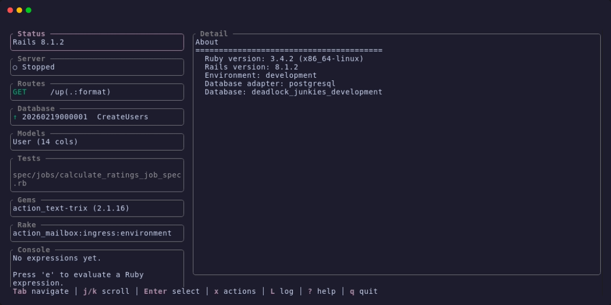
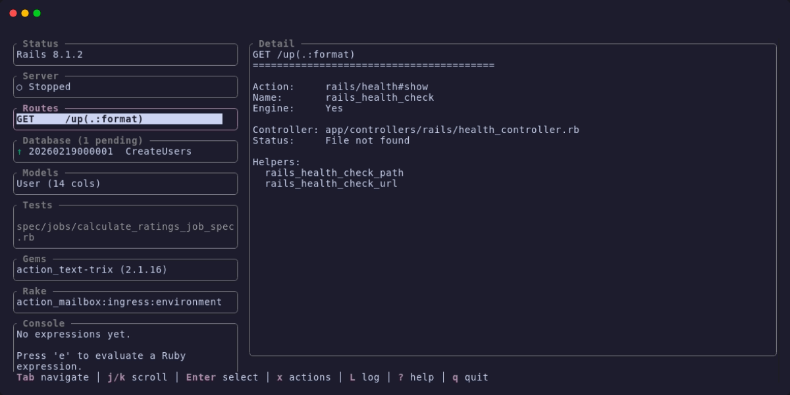
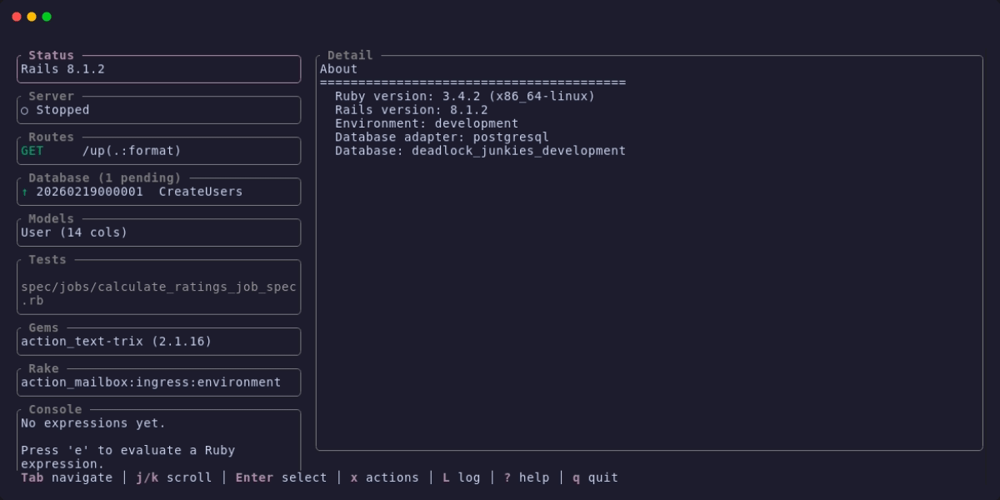
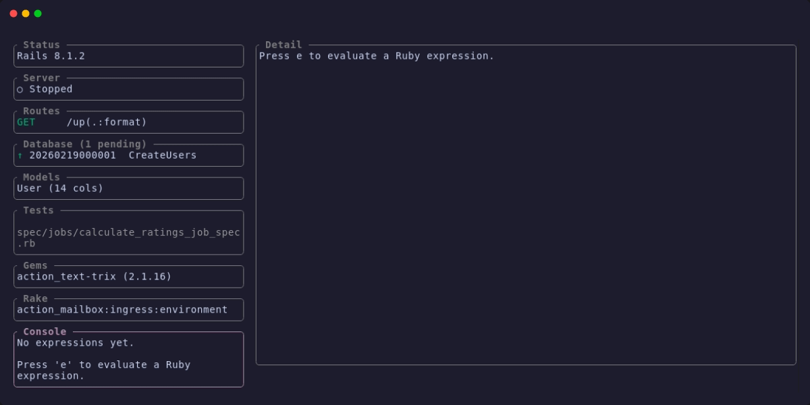

# LazyRails

A [lazygit](https://github.com/jesseduffield/lazygit)-style terminal UI for Rails. Everything the Rails CLI can do, in one split-pane interface.



Built with [Chamomile](https://github.com/xjackk/chamomile) (chamomile + petals + flourish).

## Install

```
gem install lazyrails
```

Or in your Gemfile:

```ruby
gem "lazyrails", group: :development
```

Requires Ruby >= 3.2.

## Usage

```
cd your-rails-app
lazyrails
```

## What's in it

LazyRails has 13 panels you can tab between. Each one wraps a chunk of the Rails CLI:

| Panel       | What you get                                         |
|-------------|------------------------------------------------------|
| Status      | Rails/Ruby version, env, app name, git branch, stats |
| Server      | Start/stop/restart your dev server (supports bin/dev)|
| Routes      | All routes — filter, group by controller             |
| Database    | Migrations with status, run up/down, browse table data with WHERE/ORDER BY |
| Models      | Columns, associations, validations                   |
| Tests       | Run individual files or the full suite (RSpec + Minitest) |
| Gems        | Everything in Gemfile.lock — update, open homepage   |
| Rake        | All rake tasks                                       |
| Console     | Evaluate Ruby expressions without leaving the TUI    |
| Credentials | Decrypt and view per-environment credentials         |
| Logs        | Live request log tailing, filter by slow/errors      |
| Mailers     | Preview mailers, render output, open in browser      |
| Jobs        | Solid Queue — retry, discard, dispatch, filter by status |

If you add a `.lazyrails.yml`, you also get a Custom Commands panel (see below).

### Routes

Browse all routes with color-coded HTTP verbs. Filter with `/`, group by controller with `g`, and drill into any route for details.



### Generator Wizard

Press `G` to open the generator menu. A multi-step wizard walks you through naming, adding fields with type selection, and reviewing the command before it runs.



### Inline Console

Evaluate Ruby expressions directly from the Console panel without dropping to `rails console`. Results stay in your history.



## Keybindings

`?` opens the full help overlay inside the app. Here are the essentials:

**Navigation:** `Tab`/`Shift+Tab` cycle panels, `1`-`9` jump, `j`/`k` scroll, `Enter` select, `/` filter, `q` quit.

**Global:** `G` generator menu, `x` panel action menu, `R` refresh, `L` command log, `z` undo.

Each panel has its own keys — `s`/`S`/`r` for server, `m`/`M` for migrations, `a`/`f` for tests, etc. Press `x` on any panel to see what's available, or `?` for the full list.

## Generator menu

Press `G` from anywhere to scaffold new code. Pick a type (model, migration, controller, scaffold, job, mailer, channel, stimulus), type the arguments, and it runs `rails generate` for you.

## Table browser

From the Database panel, press `t` to browse table data. You can set WHERE clauses, ORDER BY, and page through results. It's raw SQL against your dev database — useful for poking around without opening a console.

## Jobs (Solid Queue)

If your app uses Solid Queue, the Jobs panel shows all queued/running/failed/scheduled jobs. You can retry or discard failed jobs, dispatch scheduled jobs early, and filter by status. If Solid Queue isn't installed, the panel just says so — no crash.

## Custom commands

Create `.lazyrails.yml` in your Rails root:

```yaml
custom_commands:
  - name: "Seed Database"
    key: "s"
    command: "bin/rails db:seed"
    confirmation: yellow
  - name: "Reset Database"
    key: "r"
    command: "bin/rails db:reset"
    confirmation: red
```

Confirmation levels: `green` (runs immediately), `yellow` (y/n prompt), `red` (type the panel name to confirm).

## Safety

LazyRails won't let you accidentally nuke your database. Destructive commands go through confirmation tiers:

- `db:migrate`, `bundle update <gem>` — just runs
- `db:rollback`, `bundle update` — asks y/n
- `db:drop`, `db:reset` — you have to type the panel name to confirm

Every command is logged. Press `L` to see what ran, and `z` to undo the last reversible action.

## How it works

LazyRails shells out to `rails runner` to introspect your app — routes, migrations, models, associations, validations, rake tasks — and gets structured JSON back. This is more reliable than parsing CLI text output.

If Rails can't boot (missing gems, broken config), it falls back to parsing `db/schema.rb` and model files directly so you still get something useful.

## Development

```
git clone https://github.com/xjackk/lazyrails
cd lazyrails
bundle install
bundle exec ruby bin/lazyrails /path/to/rails/app
```

```
bundle exec rspec
bundle exec rubocop
```

## License

MIT
